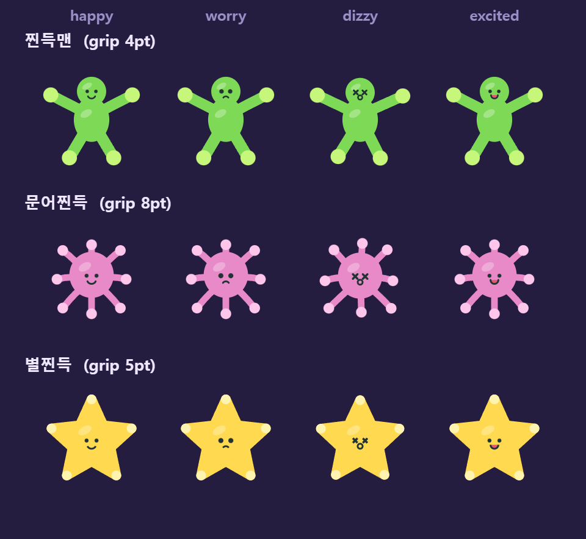
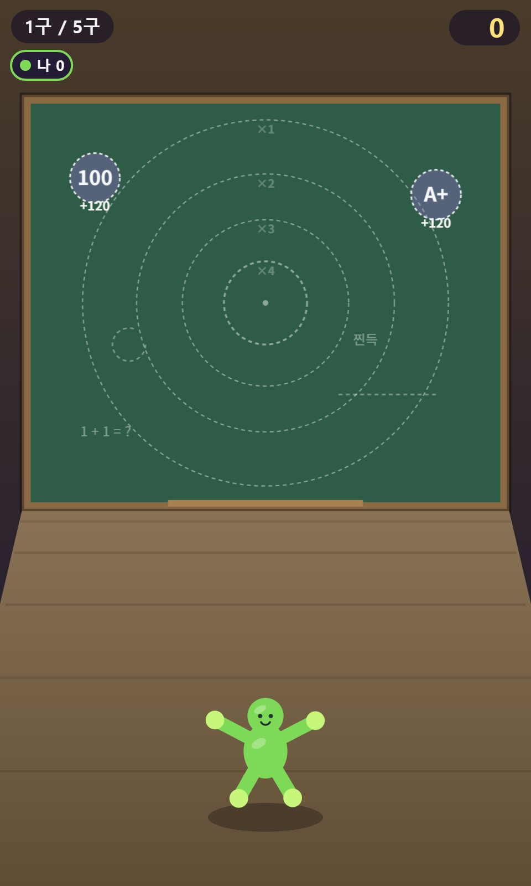
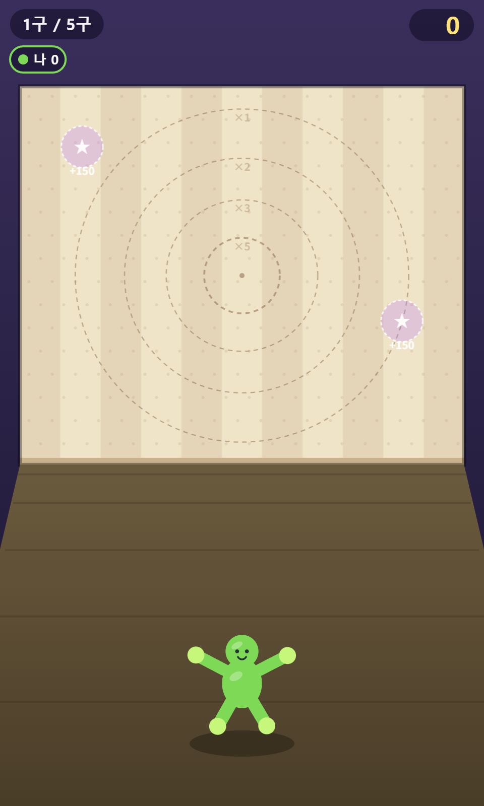
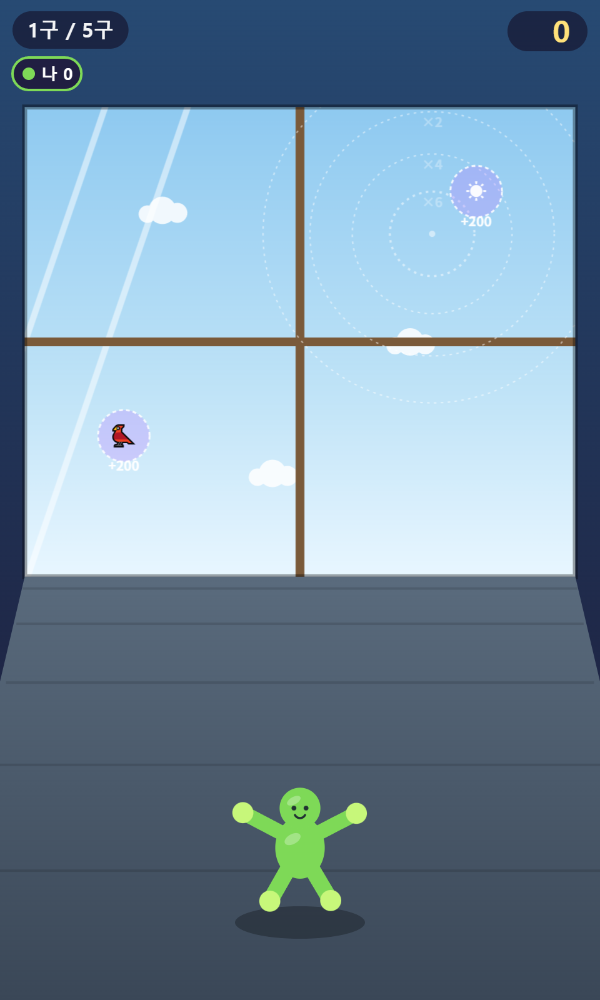
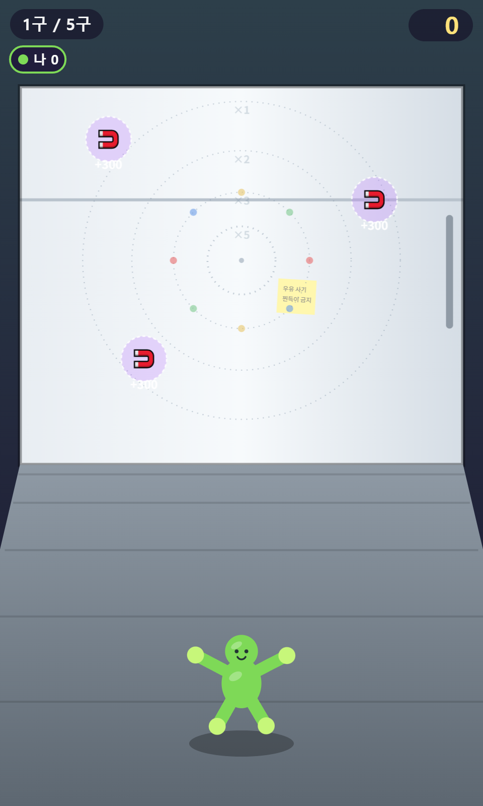

# 찹! 찐득이 — 자체 제작 리소스 카탈로그

전부 코드 생성 (외부 파일 0) · 아트 = Canvas 드로잉 · 사운드 = WebAudio 신스.

> **추적 규칙**: 리소스(아트·사운드·UI) 변경 시 이 문서의 해당 항목·상태 표를 같이 갱신한다.
> 평가 태그 — ✅ 유지 / 🔶 개선 후보 / 📝 메모.
> 캡처 이미지는 `docs/shots/`. 재촬영은 `tools/capture/` — `save_server.py`(8124) 를 띄우고
> 게임 페이지에서 `scenes.js` 를 실행하면 스토어 스크린샷 5장이 게임 렌더러로 다시 찍힌다.
> 좌표·모형·UI 가 바뀌면 반드시 다시 찍는다 (R9 이후 옛 스팟 좌표가 스토어에 남아 있었다).

## 0. 개선 후보 상태 보드

| # | 항목 | 내용 | 공수 | 리스크 | 상태 |
|---|---|---|---|---|---|
| R1 | 거실 벽 소품 | 액자(언덕·해 그림)+전등 스위치 추가 — 과녁·스팟 회피 배치 | ~30분 | 저 | **완료 2026-08-09** |
| R2 | 문어찐득 실루엣 | 다리 가늘어 세균처럼 보임 — 두께 0.15→0.16 + 밑동 0.20 이중 스트로크(테이퍼), 제어점을 반경 수직으로 0.18 밀어 한 방향 컬. 돔은 키우면 다리를 먹어서 오히려 0.50→0.46. 변형 4종 나란히 렌더해 선택. 물리(stickyPoints) 불변 | ~40분 | 저 | **완료 2026-09-02** |
| R3 | 거실 별 스팟 존재감 | 스팟 채움 알파 0.28→0.42, 링 3→3.5px/0.95 | ~10분 | 저 | **완료 2026-08-09** |
| R4 | SFX `spin()` 데드코드 | 정의만 있고 미사용 (스핀음은 `swish` 담당) — 삭제 | 5분 | 저 | **완료 2026-09-02** |
| R5 | 보너스 아이콘 무테 통일 | 이모지 텍스트(🧲🐦☀★) → 소프트 벡터 드로잉. 칠판 100/A+는 분필 낙서라 유지 | ~30분 | 저 | **완료 2026-08-09** |
| R6 | 물성(젤리) 강화 | 부착 스쿼시 = 감쇠 스프링, 팬케이크 깊이는 충격 vz 비례(살살 0.66~강타 0.54, 피크 1.16~1.22 2바운스), 롤 착지 0.7 눌림, 비행 1.08 스트레치, 접착 자국 벽 누적 스탬프(부착 0.13α·튕김/노그립 옅음) | ~50분 | 저 | **완료 2026-08-09** |
| R7 | 모바일 셸 대응 | 세이프에어리어 인셋 기준 레이아웃, 백그라운드 오디오 정지, DOM 토스트, Android 뒤로가기 네비게이션 | ~60분 | 저 | **완료 2026-08-24** |
| R8 | 앱 아이콘·스플래시 | 런처 아이콘(적응형 포함)은 `shapes.js` 드로잉 코드로 렌더, 스플래시는 Studio Mangru 워치타워 로고. 생성기는 `tools/gen_android_assets.py` | ~70분 | 저 | **완료 2026-08-25** |
| R9 | 칠판·거실 보너스 스팟 도달 불가 | 스팟이 전부 크롤 경로 밖(x 0.14~0.2 / 0.8~0.86)에 있어 칠판 **0%**·거실 0%. 도달 가능 영역(x 0.23~0.77, y 0.22~0.95) 안으로 재배치 → 접촉률 칠판 27.0% / 거실 28.0% / 유리창 32.0% / 냉장고 49.0% | ~40분 | **중** | **완료 2026-09-01** |
| R10 | "퍼펙트"가 78% | 판정이 `q > 0.9` 였는데 이는 충격비 `r` 0.42~0.79 = 부착 범위의 37% 다. `PERFECT_BAND = 0.035` 로 `\|r-SWEET\|` 직접 판정으로 교체 (고정 폭은 R15 에서 조합별 가변 폭으로 대체) | ~20분 | 중 | **완료 2026-09-01** |
| R11 | 게이지 limit 표시 오차 | 접선 보정이 상수 `-0.4` 라 관대한 벽일수록 오차가 컸다(칠판 표시 2.805 vs 실제 2.42). 속도 비례식으로 교체 | ~30분 | 중 | **완료 2026-09-01** |
| R12 | 해금이 8분에 끝난다 | 실측 평균 5라운드(8분)·숙련 4라운드에 전부 해금. 임계값을 3k/5k/12k/15k → **4k/10k/25k/45k** 로. 첫 해금(유리창)은 여전히 2라운드라 온보딩 훅 유지, 별찐득은 평균 13라운드(20분). 파티 모드 누적도 전원 합 → **최고 1인** 으로 (8인 파티 1판 = 24,000점이라 임계값이 무의미했다) | ~30분 | 저 | **완료 2026-09-02** |
| R13 | 냉장고 자석 2개가 동시에 터짐 | 판정 반경(`r×unit + TOY_R×0.5` = 0.249m)이 그려지는 반경(0.164m)보다 커서, `(0.30,0.78)`·`(0.38,0.88)` 의 판정 원이 겹쳤다(중심거리 0.374 < 0.498). **두 자석 어디에도 안 닿아 보이는 자리에서 +600 이 한 틱에 터진다.** 3번 자석을 `(0.62,0.92)` 로 이동(중심거리 0.614, 여유 23%) | ~40분 | **중** | **완료 2026-09-02** |
| R14 | 게이지 sweet 마커가 퍼펙트를 못 줌 | `limit` 과 `sweet` 을 같은 상수(1.20)로 나눠, 최악 기준 보정이 목표점에까지 걸렸다. 마커를 정확히 따라도 12개 조합 중 **냉장고 2개에서만** 퍼펙트가 나왔다. `TANGENT_DIV`(1.21, limit)·`SWEET_DIV`(1.06, sweet)로 분리 → 10개 조합. 겸사 limit 도 진짜 하한이 됐다(당시 28,297회 스윕 튕김 0회, 이전 4.97%). sweet 상수는 R15 에서 닫힌 해로 대체 | ~50분 | **중** | **완료 2026-09-02** |
| R15 | 퍼펙트 밴드 폭이 맵마다 다름 | 접선 항이 `s0 ≈ 1.29`(도착=궤적 정점)에서 부호를 뒤집어, `r` 의 세기 민감도가 맵마다 3배 넘게 갈렸다(세기 기준 폭 칠판 8.1% vs 냉장고 28.0% → 퍼펙트율 22% vs 62%). 밴드를 **조합(모형×맵)당** sweet 지점 할선 민감도에 비례시키고, sweet 은 `r(s)=SWEET` 의 닫힌 해로. 첫 구현(던지기마다 `sign(vy)`)은 적대적 리뷰가 잡았다 — 정점에서 3단 불연속이라 퍼펙트 구간이 섬 4개로 쪼개졌다. 벽 충돌도 서브스텝 보간으로 바꿔 프레임 히치에 무관. 수식을 `sticky.js` 한 곳으로 모아 게임·시뮬 공용. 유리창 grip 0.85→0.90(판별식 절벽 여유 8%). 결과 **퍼펙트율 9~25%, 세기 폭 7.9~8.9%(별×유리창만 4.9%, 접촉 기하), 구간 1개, 마커 정확도 100%** | ~3시간 | **중** | **완료 2026-09-02** |
| R16 | 턴 배너가 스팟을 가림 | 배너(정규화 y 0.571~0.794)가 재배치된 스팟 9개 중 8개를 1.2초 덮는데 입력은 즉시 열린다. 잡는 순간 `banner.t` 를 0.3 으로 당겨 페이드아웃 — 빨리 던지는 플레이어는 즉시 시야 확보, 아니면 배너 온전히 표시 | ~10분 | 저 | **완료 2026-09-02** |

외부 아트 피드백(2026-08-09, "물성·아이콘·여백" 지적) → R5·R6 도출. 기각: 폰트(제약)·바닥 소품(조작 영역)·상시 흐리기(정보 트레이드오프).

상태 값: 제안 → 진행 → 완료 / 보류. 완료 시 날짜 병기.

## 1. 모형 3종 × 표정 4종 (`game/js/shapes.js`)

| 모형 | 구성 | 평가 |
|---|---|---|
| 찐득맨 (기본) | 양손·양발 4패드 · 팔다리 캡슐 + 몸통/머리 블롭 + 글로스 | ✅ 실루엣 명확, 게임 아이덴티티 |
| 문어찐득 (10,000 해금) | 방사 8다리(밑동 이중 스트로크·한 방향 컬) + 중앙 돔 | ✅ R2 완료 |
| 별찐득 (45,000 해금) | 꼭짓점 5패드 · 라운드 별 + 스웰 애니 | ✅ excited 입(핑크) 포인트 |
| 표정 시스템 (공통) | happy / worry(크롤 위기) / dizzy(낙하) / excited(퍼펙트) + 부착 패드 글로우 | ✅ 상태 전달 잘 됨 |

## 2. 맵 4종 (`game/js/materials.js`)

| 칠판 | 거실 | 유리창 | 냉장고 |
|---|---|---|---|
|  |  |  |  |

| 맵 | 특징 소품 | 평가 |
|---|---|---|
| 교실 칠판 (기본, 그립 1.3) | 낙서(1+1=?·찐득)·지우개 자국·분필 트레이·나무 테두리(노그립) | ✅ 디테일 기준점 |
| 거실 벽 (기본, 그립 1.0) | 줄무늬+도트 벽지, 별 스팟 2, 액자·전등 스위치 | ✅ R1·R3 완료 |
| 유리창 (4,000 해금, 그립 0.9) | 4분할 창틀(십자 노그립)·유리 광 사선·구름·새/해 스팟 | ✅ 광 표현 좋음 |
| 냉장고 (25,000 해금, 그립 0.9) | 자석 스팟 3(+300)·포스트잇("우유 사기/찐득이 금지")·자석 도트·손잡이(노그립) | ✅ 유머 소품 좋음 |

## 3. 인게임 UI · 이펙트 (canvas, `game/js/main.js`)

| 요소 | 내용 | 평가 |
|---|---|---|
| 파워 게이지 | 과속 빨강 / 부착 초록 존 / 스윗 라인 / 니들 — 맵·모형별 밴드 실계산 | ✅ |
| 부분 궤적 | 릴리즈 예측 점선 (1/120 서브스텝, 벽 중간까지) | ✅ |
| 커브볼 모드 게이지 | 셰브런 흐름 변신 (속도 = 스핀 각속도 연동) + 꺾임 예고 화살표 | ✅ |
| 온보딩 | 첫 판 가이드 문구 + 고스트 손 스와이프 루프 (localStorage 1회) + 조준 중 6초 무입력 시 고스트 재등장(잡으면 리셋) | ✅ |
| 크롤 HUD | 머리 위 그립 바·패드 글로우·+N 플로터·타이머×배율 배지 | ✅ |
| 파티 HUD | 플레이어 색 링·개인 그립 바·이름표·상단 인원 캡슐 | ✅ |
| 파티클·연출 | 스플랫 튐·착지 먼지·낙하 트레일·히트스탑·셰이크 | ✅ |
| 젤리 물성 | 부착 스쿼시 스프링(팬케이크→오버슈트 2바운스)·비행 스트레치·롤 착지 눌림 | ✅ R6 |
| 접착 자국 | 부착/튕김 시 벽 캐시에 모형 색 얼룩 영구 스탬프 — 세션 내 누적 | ✅ R6 |
| 토스트 | 짧은 안내 배너(DOM, 오버레이 위 z-index 30) — 뒤로가기 2회 확인 안내 | ✅ R7 |
| 폰트 | Malgun Gothic 시스템 폰트 | 📝 file:// 제약상 웹폰트 불가 — 수용 |

참고 컷: `shots/pdf_a_room_aim.png`(게이지+궤적) · `shots/itch_s3_curve.png`(커브 모드) · `marketing/itchio/itch_s2_crawl.png`(크롤) · `shots/04-party-simul-room.png`(파티).

## 4. 메뉴 화면 (DOM, `game/index.html` + `game/js/ui.js`)

| 화면 | 구성 |
|---|---|
| 타이틀 | 로고 텍스트 + 시작/리더보드 + FAB(사운드·언어, 좌하단 가로) |
| 모드 선택 | 연습 / 파티 카드 |
| 파티 설정 | 인원 2~8 스테퍼 · 구수 · 동시 크롤 토글 |
| 모형·맵 선택 | 카드 그리드 + 캔버스 실시간 미리보기 + 해금 잠금(필요 점수 표기) |
| 결과 | 점수·버틴 시간·보너스 내역 + 이니셜 저장(연습) / 순위 연출(파티) |
| 리더보드 | localStorage top10 · 이름/점수/최고 버티기 |

## 5. 사운드 (`game/js/audio.js` — 신스 SFX 22종 + BGM)

| 이름 | 트리거 | 설계 | 평가 |
|---|---|---|---|
| ui / tick | 버튼 · 잠금 카드 · 초 틱 | 스퀘어 660→880 / 사인 990 단음 | ✅ |
| grab | 찐득이 잡기 | 사인 300→380 | ✅ |
| swish | 스핀 홀드(0.3) · 커브 비행(0.12) | 밴드패스 노이즈 1.1k→3.4k | ✅ |
| whoosh | 던지기 릴리즈 | 노이즈 스윕 0.5k→3.2k | ✅ |
| splat / perfect / goodStick | 부착 (항상/퍼펙트/양질) | 사인 드롭+노이즈 / 4음 아르페지오 / 2음 띠링 | ✅ 타격감 핵심 |
| curveHit | 커브 보너스 부착 | 4음 스파클 상승 | ✅ |
| bounce + stingBad | 과속 튕김 | 사인 하강 ×2 + 톱니 불협 스팅 | ✅ 실패 구분 명확 |
| sadDrop | 도달 실패 · 낙하 정산 | 트라이앵글 하강 2음 | ✅ |
| flip / land / slip / peel / pop | 크롤: 롤/재부착/미끄덩·스윙/필 시작/패드 분리 | 사인 드롭 / 저음 탭 / 고음 톱니 / 노이즈+상승 / "뽁" | ✅ 크롤 서사 전달 |
| fallWhistle + thud | 낙하 휘슬 + 바닥 | 사인 1.2k→300 + 저음 120→45+노이즈 | ✅ |
| spot | 보너스 스팟 획득 | 3음 상승 벨 | ✅ |
| turn / fanfare | 턴 전환 / 결과 | 2음 콜 / 5음 팡파레+샴머 노이즈 | ✅ |
| spin | **미사용** (정의만 존재) | 사인 랜덤 500~800 | 📝 R4 데드코드 |
| BGM | 첫 상호작용 후 상시 (뮤트 토글) | A-F-G-E 코드 루프 2.4s 트라이앵글 패드 + 펜타토닉 플럭, 볼륨 0.16 | ✅ 유지 확정 (2026-08-09, 은은함 의도) |

## 6. 앱 아이콘 · 스플래시 (Android)

게임은 에셋 파일이 0개라 소스 아트가 없다. 아이콘은 **게임 자신의 드로잉 코드**
(`shapes.js` 의 `man.draw()`)로 렌더해서 만들었다 — 인게임 찐득이와 아이콘이
같은 코드에서 나오므로 어긋날 수가 없다.

스플래시는 게임이 아니라 **퍼블리셔를 보여주는 자리**라 Studio Mangru 워치타워
로고를 쓴다 (`assets/mangru-logo-03.svg`).

| 요소 | 내용 | 평가 |
|---|---|---|
| 소스 아트 | `assets/icon.png`(1024) · `assets/icon-foreground.png`(1024, 적응형 안전영역 66% 준수) · `assets/splash.png`(2732, 로고 SVG 래스터화) | ✅ R8 |
| 아이콘 | 벽에 눌린(squash 0.84) 찐득이 + 접착 자국. 적응형 배경은 단색 `#2A2145` | ✅ R8 |
| 스플래시 | Studio Mangru 워치타워 로고 + 크림 `#F5F0E6` 배경 (브랜드 자산의 관례 톤). 워드마크는 Montserrat 800 | ✅ R8 |
| 생성기 | `tools/gen_android_assets.py` — Pillow 로 리사이즈·원형마스크·CENTER_CROP. `@capacitor/assets`(sharp 네이티브 30MB) 대신 | ✅ R8 |
| 밀도 세트 | 런처 5종 × (일반·원형·적응형 전경), 세로 스플래시 5종 + 기본 1종 = **22 파일 345KB** | ✅ |

세로 고정 앱이라 `drawable-land-*` 는 만들지 않는다 — 표시될 일이 없는데 APK 만
2MB 넘게 불린다. 스플래시 배경도 평면이라 PNG 가 잘 눌린다. 4.4MB → 345KB.

## 변경 로그

- 2026-08-09: 카탈로그 최초 작성 (전수 실사 + 평가). R1~R4 등록.
- 2026-08-09: 아트 폴리시(art-polish) — R1·R3·R5·R6 완료. 외부 피드백 반영: 젤리 물성(스쿼시 스프링·접착 자국), 아이콘 무테 벡터, 거실 소품·스팟 강화. 스팟 아이콘은 `main.js _spotIcon`, 자국은 `main.js _stainWall`, 스프링은 `sticky.js update`.
- 2026-08-24: 모바일 셸 대응(feat/mobile-shell) — R7 완료. 세이프에어리어는 #wrap 인셋 + `main.js resize()` 실측, 백그라운드 오디오는 visibilitychange → `Audio.suspend/resume`, 뒤로가기는 `UI.back()`(메뉴 계층 + 2초 내 2회로 라운드 포기·앱 종료). 토스트는 `#toast` DOM + `UI.toast()`.
- 2026-08-25: 앱 아이콘·스플래시(feat/app-assets) — R8 완료. 소스 아트를 `shapes.js` 드로잉 코드로 렌더(`assets/`), 안드로이드 리소스는 `tools/gen_android_assets.py` 로 생성. 가로 스플래시 제외 + 평면 배경으로 4.4MB → 470KB.
- 2026-08-25: 스플래시를 Studio Mangru 워치타워 로고로 교체. `assets/mangru-logo-03.svg` 를 2732 로 래스터화해 크림 `#F5F0E6` 배경에 앉혔다 (로고 보라 `#4E176E` 가 게임 배경 `#1a1530` 위에서는 거의 안 보인다). `SplashScreen.backgroundColor` 도 크림으로 맞춤. 470KB → 345KB.
- 2026-09-01: 업적 수치 산정을 위한 물리 시뮬레이션(맵 4종 × 스킬 3단계 × 300회 + 스팟 도달성 1,512조합 훑기). 부산물로 밸런스 이슈 4건 발견 → R9~R12 등록. 측정값과 확정된 업적 목록은 `marketing/googleplay/PLAY_GAMES.md` §4.
- 2026-09-01: R9 완료 — 보너스 스팟 4개 맵 재배치(fix/spot-reach). 배치 제약을 `materials.js` 헤더 주석과 `docs/GDD.md`에 명시.
- 2026-09-01: R10·R11 완료(fix/balance-perfect-gauge). 퍼펙트 판정을 `bell()` 품질 대신 충격비 밴드(`PERFECT_BAND=0.035`)로 교체. 게이지 접선 보정을 상수 뺄셈에서 비례식으로 교체.
- 2026-09-02: R13 완료 — 냉장고 3번 자석을 `(0.38,0.88)` → `(0.62,0.92)`. 적대적 코드리뷰(Codex)가 잡아낸 건으로, **판정 반경이 그려지는 반경보다 커서** 두 자석의 판정 원이 겹쳐 있었다. 겹침 영역의 중심은 각 자석 중심에서 0.187m 떨어져 있어 **어느 자석에도 안 닿아 보이는데 +600 이 한 틱에 터졌다.** 새 좌표는 중심거리 0.614m(임계 0.498m 대비 여유 23%)이고, 개별 접촉률 31.3%로 기존 34.7%와 거의 같아 맵 성격은 유지된다.
- 2026-09-02: R14 완료 — 게이지 상수를 `TANGENT_DIV`(limit, 최악 기준 1.21)와 `SWEET_DIV`(sweet, 전형 기준 1.06)로 분리. 하나로 묶여 있어 sweet 마커가 퍼펙트 밴드 아래로 밀려나 있었다.
- 2026-09-02: R15 완료 — 퍼펙트 밴드를 조합(모형×맵)당 sweet 지점의 민감도에 비례시키고, 게이지 `sweet` 을 상수 나눗셈에서 `r(s)=SWEET` 의 닫힌 해로 교체. 접선 항이 `s0 = √(g·d/KZ/KY) ≈ 1.29 px/ms` 에서 부호를 뒤집는 게 원인이었다 — 그 아래로 던지면 도착 시점에 이미 하강 중이라 세게 던질수록 `|vy|` 가 줄어 `r` 이 둔감해진다. 냉장고 sweet(1.17)이 그 아래라 퍼펙트 구간이 3배 넓었다. 부수로 유리창 grip 0.85→0.90 (해가 판별식 절벽 바로 위라 sweet 이 0.97 까지 내려가 창틀에 걸렸다). `SWEET_DIV` 매직넘버는 사라졌다.
- 2026-09-02: R15 2차 — 적대적 리뷰(Codex) MAJOR 6건 반영. ① 던지기마다 `sign(vy)` 로 밴드를 재던 첫 구현은 정점에서 3단 불연속이라 퍼펙트 구간이 섬 4개로 쪼개졌다 → 조합당 1값(할선 기울기). ② 벽 충돌을 서브스텝 끝 상태로 쓰던 적분기는 프레임 히치 한 번에 착탄 y 가 0.1m 흔들렸다 → `stepFlight` 에서 z=WALL_Z 로 위치·속도·angle·spin 선형 보간. ③ 게이지 수식이 main.js·sim.js 에 복사돼 있었다 → `sticky.js` 한 곳(`ST.Sticky.gaugeBand/perfectBand`)으로 통합, 하네스는 그 함수를 그대로 호출. ④ 근 없는 저그립 폴백을 s0 에서 하강식 최소점으로. ⑤ `gaugeBand` 가 min≤sweet≤limit≤max 를 보장. ⑥ `tools/sim/gauge.js` 를 검사 5종으로 재작성(구간 열거·히치·절벽 여유). **퍼펙트율 25/23/9/18%, 세기 폭 7.9~8.9%(별×유리창 4.9% 포함 시 비율 1.83), 구간 1개, 마커 r 정확히 0.6200.**
- 2026-09-03: R15 3차 — 리뷰 3차가 잡은 3건. ① 서브스텝이 N=2 고정이라 프레임 길이에 비례했고, 보간은 마지막 교차만 고쳐 100ms 히치면 착탄 y 가 2cm 틀어져 유리창 창틀에서 튕겼다 → 서브스텝 크기 고정(≤1/120s). 검사 4 를 위치·접촉·결과·퍼펙트 동일성 검사로 강화, **1,728케이스 Δpos = 0**. ② 검사 3 이 star×glass 를 건너뛰고도 "전부 통과" → 못 찾으면 FAIL, 12/12 조합 강제. ③ 문서 수치가 하네스와 불일치 → `tools/sim/baseline.json` 스냅샷 + `sim.js --check`. 부수로 `sim.js 300 --update` 가 `--update` 를 시드로 읽어 NaN→0 으로 돌던 인자 버그 수정.
- 2026-09-03: R15 4차 — 리뷰 4차. A·B 해결 확인, 남은 3건. ① 3차의 `max(2, ceil(dt/H))` 가 120Hz 에서 1/240 스텝을 만들어 60Hz 와 결과가 달랐다(유리창 (60,410) 0.9×sweet: 60Hz 부착 / 120Hz 튕김) → **고정 타임스텝 누적기**(H_STEP=1/120, 나머지 이월). 검사 4 를 22종 스케줄(히치·90/120/144Hz·지터) 5,280케이스로, Δpos = 0. ② baseline 비교기가 빈/부분 파일을 통과시키던 false-pass → 양방향 비교 + 스키마 확인. ③ 문서의 폭 "7.9~8.9%" 에 별×유리창 4.9% 누락 → 명시 + `gauge.js --check`/`gauge-baseline.json` 추가.
- 2026-09-02: **이전 밸런스 수치를 전부 폐기하고 다시 쟀다.** 예전 시뮬 하네스는 리포에 없었고(재현 불가), 던지기 세기를 **절대값 1.05 px/ms 로 고정**하고 있었다. 당시 게이지 상수(1.20) 기준 맵별 sweet 은 칠판 1.50 / 거실 1.15 / 유리창 0.98 / 냉장고 1.04 라 **냉장고만 우연히 일치**했고, 그래서 "냉장고만 퍼펙트율 37%" 라는 잘못된 결론이 나왔다 — 게임 밸런스가 아니라 모델 아티팩트였다. 새 하네스는 `tools/sim/` 에 커밋했고 플레이어가 게이지 sweet 마커를 조준하는 모델을 쓴다. 시드 고정이라 문서의 수치는 `node tools/sim/sim.js 300` 으로 그대로 재현된다.
- 2026-09-02: 배포 전 폴리싱(polish/pre-release) — R12·R16·R2·R4 완료. 해금 임계값 4k/10k/25k/45k(평균 13라운드), 파티 누적은 최고 1인, 턴 배너는 잡으면 페이드, 문어 다리 굵기·컬·돔 확대, `spin()` SFX 삭제.
